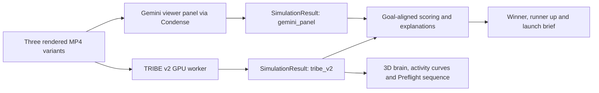

# Preflight

Launch videos that are tested before anyone sees them.

**Preflight is a standard web platform used in a desktop browser.** The product is delivered through a URL, with a web frontend and backend services. It is not an iOS/SwiftUI app and requires no native client, Xcode or iOS Simulator. The 1080x1920 videos it produces are export assets, not its application platform.

Preflight turns a product brief and 3–6 screenshots into three 15-second motion graphics videos, pretests them with simulated viewers, and exports a recommended winner, a runner up and a launch brief. The first customer is a founder launching an app or SaaS product. E-commerce is a later audience.

**[TRIBE v2 by Meta FAIR](https://github.com/facebookresearch/tribev2) is a foundational component of Preflight's planned neural pretesting system.** It supplies the predicted brain responses behind the brain simulation, synchronized activity curves, interactive 3D brain and Preflight sequence. Gemini supplies the complementary viewer panel and the agent's planning/explanations; Preflight coordinates generation, simulation, comparison and export.

## At a glance

**Problem.** A founder launching an app needs a demo video, but agencies take weeks, DIY looks amateur, and nobody knows which version works until ad money is spent.

**What Preflight does.** Brief + 3–6 screenshots in, three source-grounded 15-second videos out, each pretested by simulated viewers (a Gemini viewer panel, plus TRIBE v2 predicted brain response when the GPU worker is up), ranked by a deterministic rule, with a winner, a runner-up for a live A/B test, and timestamped reasons.

**How it is built.**

| Subproject | Path | Stack | Checked by |
| --- | --- | --- | --- |
| Web canvas + Gemini Live Director | `app/`, `components/`, `hooks/`, `lib/` | Next.js 16, React 19, Zod, three.js | typecheck, ESLint, Vitest, build |
| Pipeline orchestrator | `backend/` | Python 3.12, FastAPI, Pydantic | ruff, mypy (strict), pytest (≈97 % coverage) |
| Video renderer | `workers/renderer/` | Remotion | typecheck |
| Brain simulation worker | `workers/tribe/` | TRIBE v2 (Meta FAIR), FastAPI | ruff, mypy, pytest |

The backend is ports-and-adapters: every stage (planner, renderer, simulators, explainer) implements a protocol in `backend/src/preflight/ports.py`, `wiring.py` binds the real adapters, and the resumable state machine in `orchestrator/` never knows which provider is behind a port. All simulators speak one `SimulationResult` contract, so scoring and UI are provider-agnostic. See [docs/backend/ARCHITECTURE.md](docs/backend/ARCHITECTURE.md). All four subprojects run in [CI](.github/workflows/ci.yml) on every pull request.

**Current approved specification: [PRD v1.6](PRD.md).** It supersedes earlier brainstorming, including editing an existing customer video, and establishes the FLORA-referenced canvas, integrated Live Director and reusable-brain architecture. This repository is the shared reference for the hackathon team and its coding agents.

## Start here

| Document | Purpose |
| --- | --- |
| [PRD.md](PRD.md) | Product scope, FR-01–FR-16, acceptance criteria, architecture, UI, timeline and decision log. The source of truth for what to build. |
| [TEAM.md](TEAM.md) | Owners, task status, integration evidence, open blockers and the shared Git/Conductor workflow. |
| [AGENTS.md](AGENTS.md) | Instructions every coding agent must follow. Claude loads these through [CLAUDE.md](CLAUDE.md). |
| [Visual baseline](docs/design/README.md) | All three original reference images and the motion clip, shared visual direction, provenance and the existing Dashboard preview. |
| [Opus 5.5 brain brief](docs/design/OPUS_BRAIN_BRIEF.md) | Complete interactive browser brain, reuse/data boundaries, A/B synchronization and verification/handoff. |
| [Original PDF](docs/source/Preflight-PRD-v1.1.pdf) | Unchanged, 20-page source supplied by the product owner. [Provenance and checksum](docs/source/README.md). |

Humans: start with PRD §1–§7. Builders: also read §8–§14. Agents: read AGENTS.md and PRD §15, §8, §9, §10 and §12 before implementing.

## How to run

The web app opens directly into a sparse black dotted Preflight canvas. First arrival shows a short upload/Enable Live invitation; once the project has content, exactly three proposed A/B/C concepts branch from the confirmed source brief, with five editable three-second scenes each. The bottom composer contains the two-way Gemini Live Director, typed fallback, on-demand transcript, real input/output audio state, mute and disconnect. Voice, typed commands and clicked controls use the same validated revisioned draft; source-backed pre-render edits persist in browser storage and, in a writable Node deployment, `data/projects/{project_id}/draft.json`.

The standalone 64 px `ThinkingOrb` maps connection, listening, actual tool work and audible playback to supported states; it grows to approximately 96 px only while analyzed assistant output is audible. `VoiceBeam` has no idle glow and reads the existing Live `AudioContext`: microphone RMS is `inputLevel`, an analyser after the playback gain supplies `outputLevel`, and `isSpeaking` comes from scheduled output that is currently audible. Interruption, output mute and disconnect stop and discard every queued source immediately. No second microphone or voice service is opened.

The repository now includes the Python pipeline, Remotion renderer and TRIBE worker foundations, but the Next.js preview does not assume they are deployed. Without `PREFLIGHT_API_URL`, confirmed Run saves the validated inputs and visibly reports that the generation pipeline is unavailable; it never fabricates planning/render/simulation progress. Production draft persistence still needs a durable storage adapter because Vercel function filesystems are ephemeral/read-only outside `/tmp`.

```bash
git clone https://github.com/clawmax12-lang/Norrsken.git
cd Norrsken
cp .env.example .env.local
npm install
npm run dev
```

Use Node.js 20.9 or newer. Set `GOOGLE_API_KEY` in `.env.local` to an AI Studio key with access to `gemini-3.8-live` (`GEMINI_API_KEY` and the existing lowercase Vercel variable `google` remain fallbacks), then open `http://localhost:3000` in current desktop Chrome. Click the mic in the bottom composer once to grant microphone permission. The Director uses the female-sounding `Kore` preset. The folder tool grants read access to one folder; Preflight indexes at most 100 PNG/JPG filenames locally and uploads only the 3–6 selected screens after explicit Run confirmation.

Typed fallback works without a Live connection. It accepts natural structured phrases such as `product is …`, `description is …`, `audience is …`, `goal is downloads`, `select A scene 2`, `use description as copy`, `move scene 2 to 1`, and `run preflight`.

The permanent key is read only by `/api/live-token`, which exchanges it for a one-use, short-lived token. It must never use a `NEXT_PUBLIC_*` name, appear in client code or be committed. In Vercel, add `GOOGLE_API_KEY` to the intended project/environment and redeploy. Browser microphone access requires HTTPS (Vercel preview) or localhost plus a user gesture.

Set `PREFLIGHT_API_URL` only when the FastAPI orchestrator is genuinely deployed and wired. Set the public, non-secret `NEXT_PUBLIC_PREFLIGHT_API_BASE` to the same reachable origin when the browser brain should consume results/log events; configure backend CORS for the app origin. The Next route forwards the confirmed command with an idempotency key; if the value is absent or unreachable, the canvas shows the unavailable state and no job is claimed. The brain does not receive a project id until that backend accepts the run, so a local draft can never masquerade as genuine result data.

Frontend verification commands:

```bash
npm run typecheck
npm run lint
npm test
npm run build
npm audit --omit=dev
```

Backend verification commands:

```bash
./backend/.venv/bin/pytest backend/
```

The historical dashboard branch is no longer the intended product shell. FR-16 uses the canvas in this branch; do not reintroduce a separate Director screen or treat an old temporary preview as pipeline evidence.

## Brain and generation roles

Claude Opus 5.5 builds the core interactive 3D brain **once as reusable product code**. All users and A/B views use the same renderer and compatible mesh, with their own video's stored TRIBE predictions. Orbit, scrub and compare are browser rendering, not new model calls. The [original references](docs/design/README.md) set the quality bar: anatomical depth, dark silhouette, warm cortical activity and a readable video/timeline relationship.

The desired runtime split is Gemini for variants and analysis, TRIBE for predicted cortical response, and a separately budgeted Opus step for the selected finished motion-graphics composition; Remotion renders the MP4. Runtime Opus is planned, not connected or an additional P0 requirement. It needs independently verified API access, credentials and Condense routing; the Gemini key does not cover it. The existing one-template/three-video MVP remains the default. If finalization changes a video's content/timing, re-render and re-simulate that final video before presenting it as tested. Full rules: PRD §9.1 and §10.5.

## TRIBE v2: role in Preflight

Upstream repository: **https://github.com/facebookresearch/tribev2.git**. Start with its [README](https://github.com/facebookresearch/tribev2#readme), [official Colab walkthrough](https://colab.research.google.com/github/facebookresearch/tribev2/blob/main/tribe_demo.ipynb), [model weights](https://huggingface.co/facebook/tribev2) and [paper](https://arxiv.org/abs/2605.04326).

TRIBE maps video, audio and language to predicted fMRI responses for an average subject. The released demo produces approximately 20,484 cortical values per time step on the `fsaverage5` mesh, at one time step per second. These are the scientific input to Preflight's brain simulation, not decorative animation data.

The planned integration follows PRD §9–§12:



| Preflight requirement | How TRIBE contributes |
| --- | --- |
| FR-04 — pretest | `simulate_tribe` runs each rendered variant and returns a normalized `SimulationResult`, alongside the Gemini panel result. |
| FR-05/FR-06 — rank and explain | The scoring/explanation layer can use the simulation evidence through the common interface. The goal mapping and scoring rule still need implementation and documentation. Raw activation is not automatically an attention, retention or sales score. |
| FR-07/FR-12 — results and brain viewer | Real cortical samples and atlas-backed region series drive the brain surface and curves in sync with video playback and scrubbing. |
| FR-14 — Preflight sequence | The cinematic introduction visualizes genuine stored TRIBE predictions. Smooth interpolation does not create additional measured or predicted samples. |

TRIBE does not generate the product videos. Its worker consumes the renderer's MP4s; our adapter translates its arrays and timing into the shared contract. UI and scoring consume `SimulationResult`, not a provider-specific response. Keep this boundary so the product remains usable with other simulators while TRIBE powers the neural experience.

### Run a first TRIBE inference on the GPU worker

**Status:** this is an upstream-based setup guide, not a verified Preflight deployment. These commands and API names were checked against upstream commit [`af58661791a351a448a489042a28f6c37e1c14b7`](https://github.com/facebookresearch/tribev2/tree/af58661791a351a448a489042a28f6c37e1c14b7). We have not installed or run GPU inference as part of this documentation change.

Prerequisites: Python **3.11+** per upstream `pyproject.toml`, Git, a CUDA-capable GPU environment, and approved Hugging Face access to [Llama-3.2-3B](https://huggingface.co/meta-llama/Llama-3.2-3B), required by the text encoder. The PRD recommends a worker with **40 GB+ VRAM**; treat its memory estimates as planning guidance until the owner records an actual run. Confirm the dependency versions and CUDA compatibility in the upstream project. Web-app or LLM credits alone do not provide this GPU worker.

On that GPU machine, from a Preflight checkout, create an isolated environment and install the pinned upstream source:

```bash
python3.11 -m venv .context/tribe-env
source .context/tribe-env/bin/activate
python -m pip install "tribev2 @ git+https://github.com/facebookresearch/tribev2.git@af58661791a351a448a489042a28f6c37e1c14b7"
hf auth login
```

Authenticate with a Hugging Face account that has the required model access. Keep tokens out of source files and commits. The official notebook provides a Colab route; choose a GPU runtime that meets the actual memory requirements. Upstream also provides the optional `plotting` extra for its own visualizations.

Run the following Python example after replacing the video path with a real rendered variant:

```python
from tribev2 import TribeModel

model = TribeModel.from_pretrained(
    "facebook/tribev2",
    cache_folder=".context/tribe-cache",
    device="cuda",
)
events = model.get_events_dataframe(video_path="path/to/rendered-variant-A.mp4")
preds, segments = model.predict(events=events)

assert preds.ndim == 2
assert preds.shape[0] == len(segments)
print(preds.shape)  # (n_timesteps, n_cortical_vertices)
```

First use downloads model weights and extracts multimodal features. Record both first-run and warm-run duration before promising an end-to-end runtime. The setup example pins the code, not every transitive dependency or the model weights; record the actual checkpoint/config revision and environment with the run.

### Connect the worker to Preflight

1. Implement `simulate_tribe` around the upstream inference call and the `SimulationResult` contract in PRD §10.3. Agree the cortical-data and atlas/timestamp representation with the viewer owner; the simplified PRD has not specified that payload yet.
2. Save the genuine predictions, corresponding segment timing and reproducibility metadata with the run. Reduce cortical samples to visual/auditory/language curves using an agreed standard atlas, preserving vertex ordering for the mesh.
3. Align video, curves and mesh through the returned segments. Upstream documents a five-second compensation for hemodynamic lag; verify that mapping rather than automatically shifting an already-compensated result again. Do not assume a 15-second clip always returns exactly 15 usable segments.
4. Expose the worker to the orchestrator and configure `TRIBE_ENDPOINT` with **our deployed worker's address**. It is not the GitHub URL or a hosted Meta inference API supplied by the upstream project. The Preflight endpoint and request/response transport still need implementation; this guide does not define a ready-made HTTP route.
5. Verify one real clip for the go/no-go, then the actual 15-second rendered variants, including any silent/no-speech case produced by the template. Record output, timing, GPU environment and failures in TEAM.md before marking FR-04 complete.

The PRD's hackathon fallback still applies: if TRIBE fails the 12:30 gate, keep the gray reusable anatomy/dock but show **Brain sim off** for the Gemini-only run. This is a degraded execution path, not equivalent neural evidence. Never replace missing brain activity with generated values. Genuine precomputed results must be tied to the video they analyzed and visibly disclosed.

## Build stack

The FR-01/FR-16 slice uses Next.js 16, React 19, TypeScript, Zod, `@google/genai`, `thinking-orbs` 0.3.2 and `voice-glow` 0.2.1. `gemini-3.8-live` provides low-latency native audio, automatic voice activity detection, barge-in, transcripts and function calls; the Director uses the female-sounding `Kore` preset. A Next.js server route mints ephemeral Live tokens, while Live audio flows directly between the browser and Gemini. The prompt beam follows analyzed playback amplitude; microphone level is displayed separately and neither signal represents neural activity. The reusable Opus brain uses three.js and the tracked fsaverage5/head assets.

The backend pipeline (FR-01..FR-10) uses Python 3.12, FastAPI, Pydantic, and Hatchling, orchestrating concept planning, Remotion motion graphics composition specs, simulated viewer panels (Gemini via Condense), deterministic goal-aligned scoring, and export bundles. TRIBE v2 runs on a GPU worker for neural simulation.

The current Live implementation uses Gemini's direct ephemeral-token WebSocket because no compatible full-duplex Condense transport has been demonstrated. PRD v1.6 does not approve that routing exception: verify Condense Live compatibility or obtain an explicit product decision before claiming FR-10/partner-routing acceptance. Planning, viewer-panel and explanation calls must go through Condense and report real token savings when implemented.

The PRD designates **Claude Opus 5.5** as the primary coding agent. This is a build plan, not a claim that the application has already been implemented with it. This documentation bootstrap was prepared with Codex from the supplied PDF.

Environment variable names from PRD §10.4: `GOOGLE_API_KEY` (preferred), `GEMINI_API_KEY` (fallback), `CONDENSE_API_KEY`, `TRIBE_ENDPOINT`, optional server-side `PREFLIGHT_API_URL` and public `NEXT_PUBLIC_PREFLIGHT_API_BASE`. `.env.example` contains placeholders; `.env*` files remain ignored except for that example.

Runtime Opus, if integrated, requires its own server-side provider credentials (for a direct Anthropic integration, `ANTHROPIC_API_KEY`) and verified API model configuration. No customer key has been supplied or embedded by this documentation change. Keep all secrets out of the browser and shared chat/documents.

## Demo and research honesty

- Complete P0 before P1. The reusable FR-12 anatomy/dock and entry remain P0; neural response animation and analysis focus require genuine TRIBE data.
- Use genuine simulation output in the demo. Disclose precomputed TRIBE output in both the UI and this README when introduced. Never present test mocks as real results.
- Without TRIBE, finish with Gemini and show **Brain sim off**. Without brain data, show **No brain data**. Record the actual go/no-go result in TEAM.md.
- Document the implemented scoring/confidence rule here when FR-05 lands. Simulator agreement is not a demonstrated probability of real-world success.
- Do not claim that neural response predicts retention, virality, emotions or sales. Live A/B testing is the eventual validation.

Current browser integration status: one `CanvasBrain` is mounted outside the pan/zoom transform and shares the selected A/B/C variant, but stays **No brain data** until a backend-accepted project supplies genuine results. The Director cannot cite TRIBE before a completed real simulation. With no configured Google key, typed intake, folder selection and persisted browser draft edits still work while voice shows a configuration error. A real Gemini Live round trip, interruption and spoken tool edit still require provider verification in the deployed HTTPS preview; automated/synthetic audio tests do not claim that acceptance.

## Attribution and eligibility

[TRIBE v2](https://github.com/facebookresearch/tribev2), by **Meta FAIR**, is the planned brain simulation component. Its code and [model weights](https://huggingface.co/facebook/tribev2) are published under [CC BY-NC 4.0](https://github.com/facebookresearch/tribev2/blob/main/LICENSE). The PRD frames its use as research for the hackathon; commercial rights and downstream model licensing remain to be resolved before commercialization. This attribution does not relicense Preflight or imply Meta endorsement.

The supplied PRD calls for Gemini + Condense, a public repository and a two-minute demo. Rules and the exact submission deadline still require platform confirmation. Repository visibility was **PRIVATE** at the 3 Oct 2026 documentation import; visibility has not been changed by this setup. Track these items in TEAM.md.
