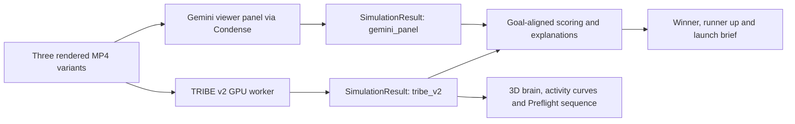

# Preflight

Launch videos that are tested before anyone sees them.

**Preflight is a standard web platform used in a desktop browser.** The product is delivered through a URL, with a web frontend and backend services. It is not an iOS/SwiftUI app and requires no native client, Xcode or iOS Simulator. The 1080x1920 videos it produces are export assets, not its application platform.

Preflight turns a product brief and 3–6 screenshots into three 15-second motion graphics videos, pretests them with simulated viewers, and exports a recommended winner, a runner up and a launch brief. The first customer is a founder launching an app or SaaS product. E-commerce is a later audience.

**[TRIBE v2 by Meta FAIR](https://github.com/facebookresearch/tribev2) is a foundational component of Preflight's planned neural pretesting system.** It supplies the predicted brain responses behind the brain simulation, synchronized activity curves, interactive 3D brain and Preflight sequence. Gemini supplies the complementary viewer panel and the agent's planning/explanations; Preflight coordinates generation, simulation, comparison and export.

**Current approved specification: [PRD v1.5](PRD.md).** It supersedes earlier brainstorming, including editing an existing customer video. The product is a web flow canvas with a cinematic brain entry, persistent brain companion and mandatory two-way female Gemini Live Director, plus the genuine video-generation/pretest/export pipeline. This repository is the shared reference for the hackathon team and its coding agents.

## Start here

| Document | Purpose |
| --- | --- |
| [PRD.md](PRD.md) | Product scope, FR-01–FR-16, acceptance criteria, architecture, UI, timeline and decision log. The source of truth for what to build. |
| [TEAM.md](TEAM.md) | Owners, task status, integration evidence, open blockers and the shared Git/Conductor workflow. |
| [AGENTS.md](AGENTS.md) | Instructions every coding agent must follow. Claude loads these through [CLAUDE.md](CLAUDE.md). |
| [Visual baseline](docs/design/README.md) | All four original reference images and the motion clip, shared brain/canvas direction, provenance and existing preview. |
| [Opus 5.5 brain brief](docs/design/OPUS_BRAIN_BRIEF.md) | Complete interactive browser brain, reuse/data boundaries, A/B synchronization and verification/handoff. |
| [Canvas and voice brief](docs/design/CANVAS_VOICE_BRIEF.md) | Mandatory two-way Gemini Live, validated storyboard edits, canvas/brain/job integration and standalone orb; optional prompt glow. |
| [Build status audit](docs/status/2026-10-03-build-audit.md) | Timestamped evidence from all nine Norrsken workspaces; prototype, implementation and genuine-data gaps are separate. |
| [Original PDF](docs/source/Preflight-PRD-v1.1.pdf) | Unchanged, 20-page source supplied by the product owner. [Provenance and checksum](docs/source/README.md). |

Humans: start with PRD §1–§7. Builders: also read §8–§14. Agents: read AGENTS.md and PRD §15, §8, §9, §10 and §12 before implementing.

## How to run

This documentation branch has no application implementation, dependency manifests, start command or test suite. Application/backend work exists in separate team branches/workspaces; the [status audit](docs/status/2026-10-03-build-audit.md) records what was actually observed. No end-to-end acceptance has been verified here. Do not infer that a feature works from its presence in the PRD.

```bash
git clone https://github.com/clawmax12-lang/Norrsken.git
cd Norrsken
```

Read the documents above and claim work in TEAM.md. The first implementation change must replace this section with the actual installation, environment, development and verification commands, checked from a clean clone. Keep it current with subsequent changes.

An existing Next.js Dashboard implementation is on the team's separate `williu16/preflight-swiftui-dashboard` branch (the name is historical; its code is web-based). Its latest **[Vercel canvas preview](https://temporary-fast-delta-pq4oez4.vercel.app/?demo=1)** was checked on 3 Oct 2026 at approximately 11:45 UTC: HTTP 200. It shows a five-way branching prototype (156 nodes), not genuine generated/tested batches or an integrated brain/voice pipeline. The older `temporary-instant-flint-xxlx4l9` preview now redirects to deployment-expired; the new one is also temporary. See the [workspace/preview details](docs/design/README.md#existing-dashboard-and-preview). This documentation branch does not yet contain that application; keep its actual run commands when integrating the docs.

## Canvas, brain and voice experience

On first arrival, the anatomical brain rotates and focuses on regions, then docks in a corner while the flow canvas opens. Sources and the validated brief branch into storyboards/concepts, rendered videos, actual simulation results and a verdict/export. The corner brain follows the selected video's stored predictions; realtime job events update the canvas. Introductory colored response requires a genuine disclosed example, not fabricated waves before a run exists.

**Two-way female Gemini Live is required for the demo (FR-16/P0), explicitly confirmed by William.** After Enable Live/mic permission, talk to the Director, interrupt a reply, select a storyboard/scene and make a source-grounded pre-render edit that visibly updates the actual validated draft/canvas. Confirm the summarized Run before paid jobs. Actual job milestones and verdict answers come from shared persisted events/evidence; transcripts, mute/stop/disconnect and typed fallback remain available. TTS-only narration, prerecorded dialogue or a reactive visual cannot pass P0.

The assistant is a standalone `ThinkingOrb`, no surrounding card, growing during actual speech. Its work states follow actual connection/mic/job state; audio-amplitude binding is our code, not a built-in orb feature. `voice-glow` is an optional prompt effect, not a voice engine. The Voice workspace proposes `gemini-3.8-live` and Kore; model/account/voice access and Condense Live routing remain unverified. No routing exception has been approved. A supplied Gemini key is not proof that Live is configured: long-lived keys remain server-side, with scoped ephemeral tokens or a secure proxy for browser Live. Pre-render editing is P0; editing/retesting a tested winner stays FR-11/P1. See the [integration brief](docs/design/CANVAS_VOICE_BRIEF.md).

The large experiment tree is a design/architecture goal. Proposed nodes are not completed neural tests; today's three-video execution cap remains until the owner approves a batch budget and the backend team measures capacity. Keep prototype/untested states visible.

## Brain and generation roles

Claude Opus 5.5 builds the core interactive 3D brain **once as reusable product code**. All users and A/B views use the same renderer and compatible mesh, with their own video's stored TRIBE predictions. Orbit, scrub and compare are browser rendering, not new model calls. The [original references](docs/design/README.md) set the quality bar: anatomical depth, dark silhouette, warm cortical activity and a readable video/timeline relationship.

The desired runtime split is Gemini for variants and analysis, TRIBE for predicted cortical response, and a separately budgeted Opus step for the selected finished motion-graphics composition; Remotion renders the MP4. Runtime Opus is planned, not connected or an additional P0 requirement. It needs independently verified API access, credentials and Condense routing; the Gemini key does not cover it. The existing one-template/three-video MVP remains the default. If finalization changes a video's content/timing, re-render and re-simulate that final video before presenting it as tested. Full rules: PRD §9.1 and §10.5.

## TRIBE v2: role in Preflight

Upstream repository: **https://github.com/facebookresearch/tribev2.git**. Start with its [README](https://github.com/facebookresearch/tribev2#readme), [official Colab walkthrough](https://colab.research.google.com/github/facebookresearch/tribev2/blob/main/tribe_demo.ipynb), [model weights](https://huggingface.co/facebook/tribev2) and [paper](https://arxiv.org/abs/2605.04326).

TRIBE maps video, audio and language to predicted fMRI responses for an average subject. The released demo produces approximately 20,484 cortical values per time step on the `fsaverage5` mesh, at one time step per second. These are the scientific input to Preflight's brain simulation, not decorative animation data.

The planned integration follows PRD §9–§12:



| Preflight requirement | How TRIBE contributes |
| --- | --- |
| FR-04 — pretest | `simulate_tribe` runs each rendered variant and returns a normalized `SimulationResult`, alongside the Gemini panel result. |
| FR-05/FR-06 — rank and explain | The scoring/explanation layer can use the simulation evidence through the common interface. The goal mapping and scoring rule still need implementation and documentation. Raw activation is not automatically an attention, retention or sales score. |
| FR-07/FR-12 — results and brain viewer | Real cortical samples and atlas-backed region series drive the brain surface and curves in sync with video playback and scrubbing. |
| FR-14 — Preflight sequence | The cinematic introduction visualizes genuine stored TRIBE predictions. Smooth interpolation does not create additional measured or predicted samples. |

TRIBE does not generate the product videos. Its worker consumes the renderer's MP4s; our adapter translates its arrays and timing into the shared contract. UI and scoring consume `SimulationResult`, not a provider-specific response. Keep this boundary so the product remains usable with other simulators while TRIBE powers the neural experience.

### Run a first TRIBE inference on the GPU worker

**Status:** this is an upstream-based setup guide, not a verified Preflight deployment. These commands and API names were checked against upstream commit [`af58661791a351a448a489042a28f6c37e1c14b7`](https://github.com/facebookresearch/tribev2/tree/af58661791a351a448a489042a28f6c37e1c14b7). We have not installed or run GPU inference as part of this documentation change.

Prerequisites: Python **3.11+** per upstream `pyproject.toml`, Git, a CUDA-capable GPU environment, and approved Hugging Face access to [Llama-3.2-3B](https://huggingface.co/meta-llama/Llama-3.2-3B), required by the text encoder. The PRD recommends a worker with **40 GB+ VRAM**; treat its memory estimates as planning guidance until the owner records an actual run. Confirm the dependency versions and CUDA compatibility in the upstream project. Web-app or LLM credits alone do not provide this GPU worker.

On that GPU machine, from a Preflight checkout, create an isolated environment and install the pinned upstream source:

```bash
python3.11 -m venv .context/tribe-env
source .context/tribe-env/bin/activate
python -m pip install "tribev2 @ git+https://github.com/facebookresearch/tribev2.git@af58661791a351a448a489042a28f6c37e1c14b7"
hf auth login
```

Authenticate with a Hugging Face account that has the required model access. Keep tokens out of source files and commits. The official notebook provides a Colab route; choose a GPU runtime that meets the actual memory requirements. Upstream also provides the optional `plotting` extra for its own visualizations.

Run the following Python example after replacing the video path with a real rendered variant:

```python
from tribev2 import TribeModel

model = TribeModel.from_pretrained(
    "facebook/tribev2",
    cache_folder=".context/tribe-cache",
    device="cuda",
)
events = model.get_events_dataframe(video_path="path/to/rendered-variant-A.mp4")
preds, segments = model.predict(events=events)

assert preds.ndim == 2
assert preds.shape[0] == len(segments)
print(preds.shape)  # (n_timesteps, n_cortical_vertices)
```

First use downloads model weights and extracts multimodal features. Record both first-run and warm-run duration before promising an end-to-end runtime. The setup example pins the code, not every transitive dependency or the model weights; record the actual checkpoint/config revision and environment with the run.

### Connect the worker to Preflight

1. Implement `simulate_tribe` around the upstream inference call and the `SimulationResult` contract in PRD §10.3. Agree the cortical-data and atlas/timestamp representation with the viewer owner; the simplified PRD has not specified that payload yet.
2. Save the genuine predictions, corresponding segment timing and reproducibility metadata with the run. Reduce cortical samples to visual/auditory/language curves using an agreed standard atlas, preserving vertex ordering for the mesh.
3. Align video, curves and mesh through the returned segments. Upstream documents a five-second compensation for hemodynamic lag; verify that mapping rather than automatically shifting an already-compensated result again. Do not assume a 15-second clip always returns exactly 15 usable segments.
4. Expose the worker to the orchestrator and configure `TRIBE_ENDPOINT` with **our deployed worker's address**. It is not the GitHub URL or a hosted Meta inference API supplied by the upstream project. The Preflight endpoint and request/response transport still need implementation; this guide does not define a ready-made HTTP route.
5. Verify one real clip for the go/no-go, then the actual 15-second rendered variants, including any silent/no-speech case produced by the template. Record output, timing, GPU environment and failures in TEAM.md before marking FR-04 complete.

The v1.5 fallback applies: if live TRIBE fails the 12:30 gate, keep the Gemini path with **Brain sim off**, the gray anatomical entry/dock and the required two-way Live Director/canvas. This is a degraded execution path, not equivalent neural evidence. Never replace missing brain activity with generated values. Genuine precomputed examples must be tied to the video they analyzed, visibly disclosed and kept separate from the current run.

## Planned build stack

The PRD proposes Next.js, TypeScript, Tailwind and three.js for the browser frontend; Python/FastAPI for orchestration; Remotion for rendering; and a GPU worker for TRIBE v2. Gemini provides planning, the viewer panel and explanations, with all LLM calls routed through Condense. Rendering and inference run on backend workers; users access the product through their browser.

The PRD designates **Claude Opus 5.5** as the primary coding agent. This is a build plan, not a claim that the application has already been implemented with it. This documentation bootstrap was prepared with Codex from the supplied PDF.

Required environment variable names from PRD §10.4: `GEMINI_API_KEY`, `CONDENSE_API_KEY`, `TRIBE_ENDPOINT`. Implementation must provide `.env.example` with placeholders; never commit real credentials or model weights.

Runtime Opus, if integrated, requires its own server-side provider credentials (for a direct Anthropic integration, `ANTHROPIC_API_KEY`) and verified API model configuration. No customer key has been supplied or embedded by this documentation change. Keep all secrets out of the browser and shared chat/documents.

## Demo and research honesty

- Complete P0 before P1. Brain anatomy/entry/dock and FR-16 voice remain P0; genuine neural animation/live inference require actual TRIBE data/go-no-go as described in PRD §8/§14.2.
- Use genuine simulation output in the demo. Disclose precomputed TRIBE output in both the UI and this README when introduced. Never present test mocks as real results.
- Without TRIBE, finish with Gemini and show **Brain sim off**. Without brain data, show **No brain data**. Record the actual go/no-go result in TEAM.md.
- Document the implemented scoring/confidence rule here when FR-05 lands. Simulator agreement is not a demonstrated probability of real-world success.
- Do not claim that neural response predicts retention, virality, emotions or sales. Live A/B testing is the eventual validation.

Current integration evidence: backend adapters/scoring are being implemented in the team's separate workspaces; **live TRIBE inference, Gemini speech, Condense routing and an end-to-end run are not yet verified by this documentation audit**. See the timestamped [status evidence](docs/status/2026-10-03-build-audit.md), rather than treating branch/session activity as product completion.

## Attribution and eligibility

[TRIBE v2](https://github.com/facebookresearch/tribev2), by **Meta FAIR**, is the planned brain simulation component. Its code and [model weights](https://huggingface.co/facebook/tribev2) are published under [CC BY-NC 4.0](https://github.com/facebookresearch/tribev2/blob/main/LICENSE). The PRD frames its use as research for the hackathon; commercial rights and downstream model licensing remain to be resolved before commercialization. This attribution does not relicense Preflight or imply Meta endorsement.

The supplied PRD calls for Gemini + Condense, a public repository and a two-minute demo. Rules and the exact submission deadline still require platform confirmation. Repository visibility was **PRIVATE** at the 3 Oct 2026 documentation import; visibility has not been changed by this setup. Track these items in TEAM.md.
