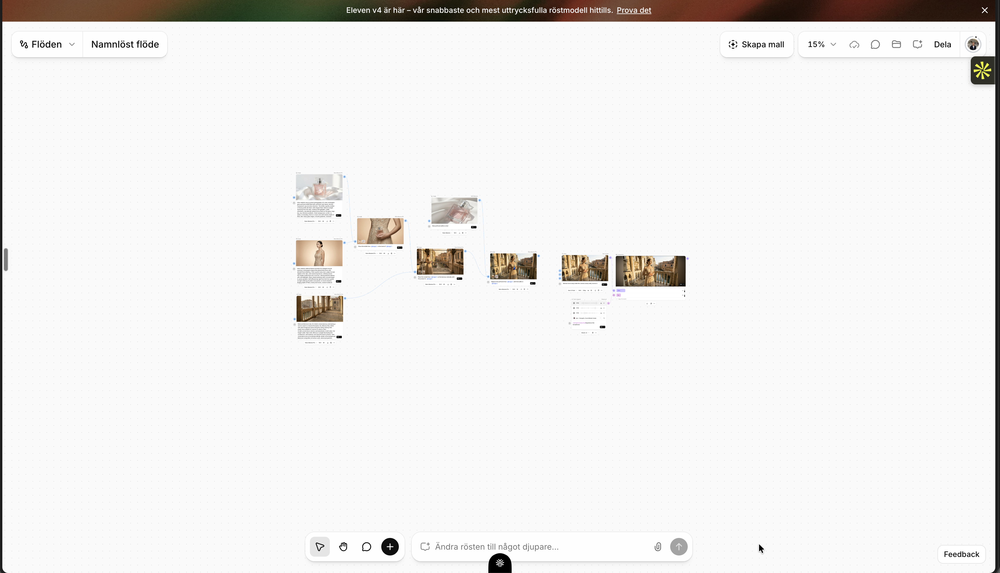
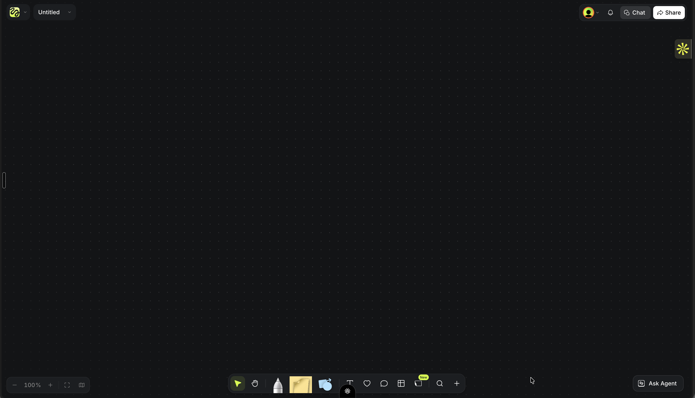
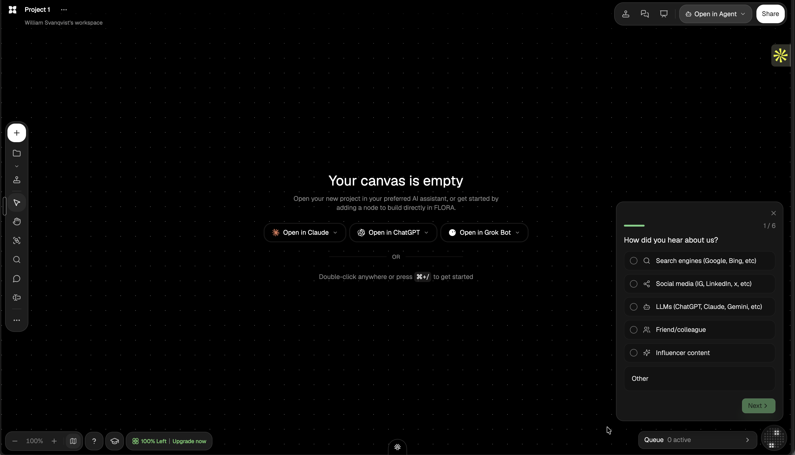
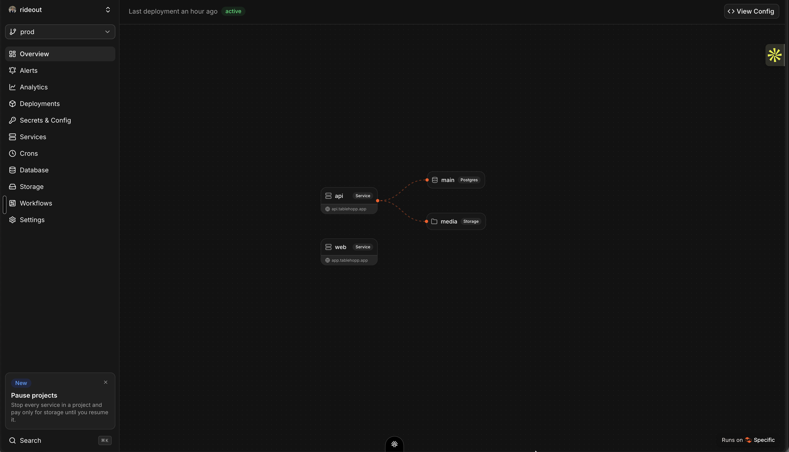

# Preflight visual baseline

**Approved direction:** eight original images and the motion clip supplied by the product owner are the shared baseline. **[FLORA](https://flora.ai/) and reference 08 are the primary main-interface target** in PRD v1.6: black dotted canvas, narrow floating tools and clean content-first branches. Specific/reference 09 and the owner's Sana-like direction reinforce restraint and contextual detail, not a new shell. Earlier canvas images remain supporting references; original brain images still define anatomy quality. Two-way female Gemini Live, standalone orb and prompt beam are required. This document supports [PRD §12](../../PRD.md#12-ui-and-the-analysis-intro); it does not replace priorities, scientific constraints or acceptance criteria in the PRD.

All originals are committed under `references/` so every teammate and Conductor workspace can access them. They are design references, not completed Preflight UI or brain simulation output. Preserve Meta/TRIBE source attribution; implement Preflight's own identity rather than copying their branding.

## Reference 01 — video, cortical response and timeline

Use this for the relationship between video, brain response and time: one shared playback position, a visible scrubber, hemisphere views and a clear activity legend. Preflight should make these elements readable together, with the A/B/C variant context and a direct route to the recommendation.

## Reference 02 — paired brains and head silhouettes

Use this for anatomical form, neutral gray cortical material, contrast against a black background, warm activation colors and the balanced two-up composition. In Preflight, two-up is **variant A versus variant B**, not "actual versus predicted": we have predicted data, not a live measurement of a user's brain.

## Reference 03 — cinematic brain hero

Use this for the visual impact of the hero: a sculptural brain with convincing folds, strong depth and lighting, a restrained dark head silhouette, large negative space and subtle HUD framing. The brain is the center of the analysis experience, not a small generic icon.

## Reference 04 — motion

[Watch the original 29-second motion reference](references/04-tribe-motion-reference.mp4).

Use it for composition, transitions and response changing over time. PRD §12.2 still specifies Preflight's own 10–15-second intro, Skip control, reduced-motion handling and honest precomputed labeling.

## Reference 05 — flow canvas

Use this for the workspace structure: a large explorable canvas, source/storyboard/media nodes, visible connections/lineage, zoomed-out overview and a bottom prompt. Adopt the interaction idea in Preflight's near-black visual language; do not copy the example's branding or treat its generated footage as permission to broaden our one-template/screenshots MVP.

Preflight opens with the brain hero, then docks the same brain in a persistent corner while the canvas expands. A female Gemini Live Director holds a real two-way conversation, selects/changes the actual source-backed storyboard and explains real work, represented by a standalone `ThinkingOrb` without an enclosing card, growing during speech, plus a restrained warm `VoiceBeam` prompt effect. A/B/variant nodes connect to real playable artifacts and matching TRIBE results; proposed branches remain untested until executed. The supplied image is a design reference, not a Preflight implementation or proof of scale. See the [canvas/voice integration brief](CANVAS_VOICE_BRIEF.md).

## References 06 and 07 — clean flows and dark canvas

These images clarified readable media/storyboard cards, curved lineage and open canvas space. They are supporting references after the owner's subsequent FLORA decision, not a reason to retain the old radial tree or copy lime/account/share features. Use real source → A/B/C storyboard → render → pretest → recommendation branches.

## Reference 08 — FLORA primary product layout

William explicitly selected **https://flora.ai/ — "exakt denna design"** and supplied this workspace screenshot. Match its spatial hierarchy: full black dotted workspace, generous negative space, narrow floating vertical tools at left, small project identity top-left, compact grouped actions top-right and discreet zoom/queue controls below. Add our bottom prompt and Gemini presence without turning the canvas into a chat dashboard. FLORA is the shell target, not an implementation dependency or new voice provider.

Use Preflight branding, licensed Redaction and restrained orange-red instead of copying FLORA's logo/green accent. The visible onboarding survey, external assistant launch buttons, upgrade/account/share features and marketing assets are not our hackathon scope. Our empty state invites source upload/Enable Live; our content is real storyboard/render/pretest evidence. Detailed [clean-flow brief](CLEAN_FLOW_DESIGN.md), [Director visuals](DIRECTOR_VISUALS.md), [font assets](../../public/fonts/redaction/README.md) and [opt-in theme](preflight-theme.css) are ready for the existing frontend owners.

## Reference 09 — Specific restraint and readable connections

The owner supplied this as an additional reference from **specific.dev**, emphasizing professional UI/UX, minimal visible chrome and "nothing left to take away", with a Sana-like sense of calm. Use compact content, disciplined spacing, subdued surfaces and clear warm connections as supporting quality cues. FLORA/reference 08 remains the primary shell; do not import Specific's permanent navigation sidebar, deployment/database features, promotional panels, branding or copy into Preflight. The screenshot is a reference, not our system's backend topology.

Apply [minimum interface, complete capability](CLEAN_FLOW_DESIGN.md#minimum-interface-complete-capability): one contextual primary action, details on demand, and persistent safety/evidence controls. Sparse does not mean low legibility, missing required features or hiding errors/privacy/data mode.

## What "extremely cool, and you can see how it works" means

The viewer should be able to follow this sequence without an explanation from the presenter:

1. A specific video variant is playing.
2. The corresponding predicted cortical activity appears on the same time axis.
3. A region or time point is selected; its card identifies the region and the actual video scene.
4. When compare mode is available, A and B show the same video time and the same camera/scale. A difference view makes the spatial change visible.
5. The user can return to the recommendation and export the assets.

Use precise, readable controls and purposeful camera movement. Palette, rhythm, depth and legibility should match the supplied quality bar. Large bloom, particles or random pulses cannot stand in for cortical data or obscure the video, legend and timestamps.

## Opus 5.5 ownership

**Claude Opus 5.5 is the requested implementation agent for the complete browser brain experience:** anatomical mesh integration, material/shaders, activity interpolation, head silhouette, camera, controls, region selection, timeline binding and the Preflight sequence. The detailed [Opus build brief](OPUS_BRAIN_BRIEF.md) defines the integration boundary and handoff.

**Build workspace:** [3D Brain — Opus 5.5](conductor://workspace?id=e14af4c4-eada-4c17-bc3b-42cd2ef08dcd&session=be40ac16-08d6-4ce4-999f-7e69ea8d4912), branch `conductor/3d-brain-opus-55`, isolated from the Dashboard. Started on 3 Oct 2026; the model was verified as `opus-5-5-1m` / `claude-opus-5-5[1m]` and the session was working. This records the assignment, not a completed renderer; implementation/preview evidence will be added to TEAM.md at handoff.

The brain renderer runs in the web frontend. TRIBE remains the neuroscience model; the GPU worker and simulator contract belong to their designated owners. No SwiftUI or native application is involved. PRD v1.6 retains the entry/anatomy/dock even if live GPU inference is off; cortical animation still needs genuine data. A/B/difference mode remains FR-15/P1 under the current PRD; the visual direction does not silently promote it ahead of unfinished P0.

## Build once, reuse across video jobs

The brain is shared product code and geometry, not a customer-specific generated asset. Opus builds it once; each analysis binds a different video's genuine stored response. A/B mode uses two instances of the same brain component with shared time, camera and scale, and separate activity data. There is no model call just to orbit, replay or open a comparison.

Gemini drives the runtime variant/analysis loop. A separate, planned Opus step can author the selected final motion-graphics composition; Remotion produces the MP4. This is distinct from Opus building the viewer and from TRIBE predicting neural response. Runtime credentials and routing are not configured yet. Changes to the final video require a new pretest before its old candidate's verdict can be reused. PRD §9.1/§10.5 remain authoritative.

## Existing Dashboard and preview

- Dashboard workspace: [open in Conductor](conductor://workspace?id=6e7c2346-1d02-4ca4-b560-17b77aba0c1c).
- Existing web implementation branch: `williu16/preflight-swiftui-dashboard`. The branch name is historical; its current application is Next.js/React/TypeScript.
- **Latest Vercel canvas preview:** https://temporary-fast-delta-pq4oez4.vercel.app/?demo=1
- Conductor preview: https://norrsken-w4.conductor.show/

The latest Vercel URL was found in the Dashboard session and checked at approximately 11:45 UTC on 3 Oct 2026: HTTP 200. Its current branch head is `2f95071`, a five-way storyline prototype with 156 nodes (5 hooks, 25 continuations, 125 next beats plus the root), not genuine batch tests or an integrated brain/voice feature. It replaces the earlier compressed "+47" view and a brief 127,551-node version; see the [status audit](../status/2026-10-03-build-audit.md). The old `temporary-instant-flint-xxlx4l9` URL now redirects to deployment-expired. The latest preview was described by its owner as a temporary 60-minute deployment, not a production address. The Conductor preview requires access and previously returned HTTP 401 to an unauthenticated request. Keep the deployed preview updated separately from these source references.

**Design status, 3 Oct at approximately 12:35 UTC:** this preview is the old radial/sidebar prototype, not the approved FLORA redesign. Opus has received the new primary direction, but adoption/deployment has not been verified. Direct Dashboard/Voice handoff is restricted by Conductor's other-member ChatGPT-plan rule; their owner must relay the tracked brief. Do not report the new shell or these effects as implemented from reference images/design-kit files alone.

## Original-file provenance

The originals were copied byte-for-byte; they were not resized, generated or retouched.

| File | Original attachment ID | Dimensions / format | SHA-256 |
| --- | --- | --- | --- |
| `01-tribe-demo-timeline.png` | `e4c73a93-5823-4ac1-8275-4827f983c4dd` | 1280 × 742 PNG | `1ef6b7094e4a894f1f5ada145ed9d6e57c930b5eb9d1a95a559454e5cdf4f6e5` |
| `02-tribe-brain-comparison.png` | `e0bf6188-21da-48c9-b019-855882844cef` | 1608 × 678 PNG | `6bd3bd62d7188db1457a871f19995acb602c562924c0c05cb5fee953243334dc` |
| `03-tribe-brain-hero.png` | `636a588b-2e7e-40c4-b12f-01556c061373` | 2142 × 1194 PNG | `b24d9eb73837efd2a76db2b86d449b726f90118d949490b766265f67db817eea` |
| `04-tribe-motion-reference.mp4` | `bac0a4f0-4002-41df-95fd-9a2f8b9b41aa` | Original MP4, approximately 29 seconds | `48134359e8d8a44849a2db263b4038654a8e07b59c39e65e41bcea428a1e0b60` |
| `05-flow-canvas-reference.png` | `d437128f-3f47-46ef-911f-66ce031458c8` | 3420 × 1962 PNG | `960b5b48f169892f9fa11117007d4bed70cf76495d552ba987d49b25c58c3d38` |
| `06-elevenlabs-flows-layout.png` | `aa9c4211-cd8d-47c2-810b-d287d42fa613` | 3420 × 1962 PNG | `e99f768f266fc0cc7e4d3e63b578233d660aa313daae7acdce589ab850f8d981` |
| `07-dark-dotted-canvas.png` | `9398120a-d11f-4fac-a26a-a5adf8d20bca` | 3420 × 1962 PNG | `b14936d8202c324407ab2a09af0ca2342f3084d22eb8b757e5c8a855a4dc2a44` |
| `08-flora-canvas-primary.png` | `07936ce0-78e6-44d6-b0c4-d3982ad4cb4c` | 3420 × 1962 PNG | `39a5152ec6e1d4a3dbaf56fc5e57403ca6884f1552ebb3353a3488cdde431b03` |
| `09-specific-sparse-flow.png` | `3512cb96-690d-4cb9-a7c2-68a1d4a52f4d` | 3420 × 1962 PNG | `0434efb3fe3190e154b54e9cfafc11bae2c387607e591606e79b42bd4730b054` |
