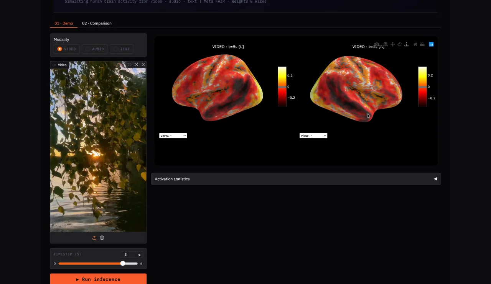
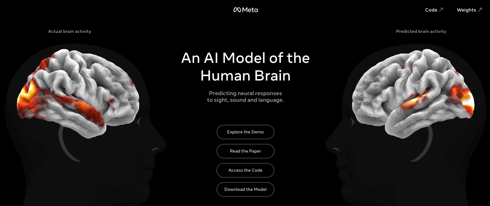
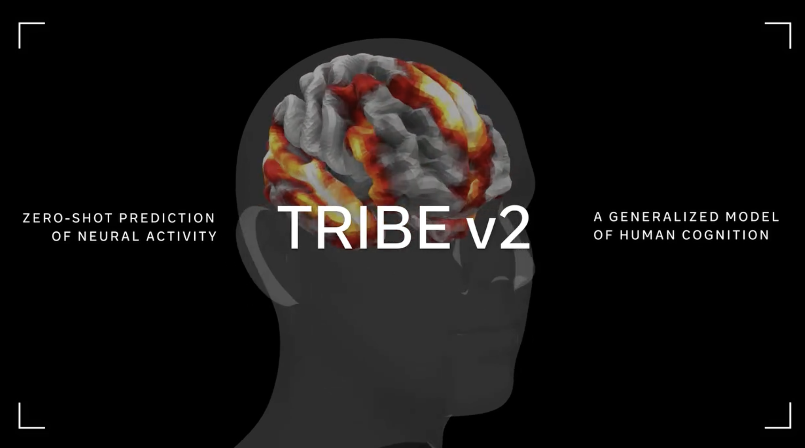

# Preflight visual baseline

**Approved direction:** the three original images and motion clip supplied by the product owner are the visual baseline for the browser-based brain experience. This document supports [PRD §12](../../PRD.md#12-ui-and-the-analysis-intro); it does not replace priorities, scientific constraints or acceptance criteria in the PRD.

All originals are committed under `references/` so every teammate and Conductor workspace can access them. They are design references, not completed Preflight UI or brain simulation output. Preserve Meta/TRIBE source attribution; implement Preflight's own identity rather than copying their branding.

## Reference 01 — video, cortical response and timeline

Use this for the relationship between video, brain response and time: one shared playback position, a visible scrubber, hemisphere views and a clear activity legend. Preflight should make these elements readable together, with the A/B/C variant context and a direct route to the recommendation.

## Reference 02 — paired brains and head silhouettes

Use this for anatomical form, neutral gray cortical material, contrast against a black background, warm activation colors and the balanced two-up composition. In Preflight, two-up is **variant A versus variant B**, not "actual versus predicted": we have predicted data, not a live measurement of a user's brain.

## Reference 03 — cinematic brain hero

Use this for the visual impact of the hero: a sculptural brain with convincing folds, strong depth and lighting, a restrained dark head silhouette, large negative space and subtle HUD framing. The brain is the center of the analysis experience, not a small generic icon.

## Reference 04 — motion

[Watch the original 29-second motion reference](references/04-tribe-motion-reference.mp4).

Use it for composition, transitions and response changing over time. PRD §12.2 still specifies Preflight's own 10–15-second intro, Skip control, reduced-motion handling and honest precomputed labeling.

## What "extremely cool, and you can see how it works" means

The viewer should be able to follow this sequence without an explanation from the presenter:

1. A specific video variant is playing.
2. The corresponding predicted cortical activity appears on the same time axis.
3. A region or time point is selected; its card identifies the region and the actual video scene.
4. When compare mode is available, A and B show the same video time and the same camera/scale. A difference view makes the spatial change visible.
5. The user can return to the recommendation and export the assets.

Use precise, readable controls and purposeful camera movement. Palette, rhythm, depth and legibility should match the supplied quality bar. Large bloom, particles or random pulses cannot stand in for cortical data or obscure the video, legend and timestamps.

## Opus 5.5 ownership

**Claude Opus 5.5 is the requested implementation agent for the complete browser brain experience:** anatomical mesh integration, material/shaders, activity interpolation, head silhouette, camera, controls, region selection, timeline binding and the Preflight sequence. The detailed [Opus build brief](OPUS_BRAIN_BRIEF.md) defines the integration boundary and handoff.

The brain renderer runs in the web frontend. TRIBE remains the neuroscience model; the GPU worker and simulator contract belong to their designated owners. No SwiftUI or native application is involved. A/B/difference mode remains FR-15/P1 under the current PRD; the visual direction does not silently promote it ahead of unfinished P0.

## Build once, reuse across video jobs

The brain is shared product code and geometry, not a customer-specific generated asset. Opus builds it once; each analysis binds a different video's genuine stored response. A/B mode uses two instances of the same brain component with shared time, camera and scale, and separate activity data. There is no model call just to orbit, replay or open a comparison.

Gemini drives the runtime variant/analysis loop. A separate, planned Opus step can author the selected final motion-graphics composition; Remotion produces the MP4. This is distinct from Opus building the viewer and from TRIBE predicting neural response. Runtime credentials and routing are not configured yet. Changes to the final video require a new pretest before its old candidate's verdict can be reused. PRD §9.1/§10.5 remain authoritative.

## Existing Dashboard and preview

- Dashboard workspace: [open in Conductor](conductor://workspace?id=6e7c2346-1d02-4ca4-b560-17b77aba0c1c).
- Existing web implementation branch: `williu16/preflight-swiftui-dashboard`. The branch name is historical; its current application is Next.js/React/TypeScript.
- **Vercel preview:** https://temporary-instant-flint-xxlx4l9.vercel.app
- Conductor preview: https://norrsken-w4.conductor.show/

The Vercel URL was found in the Dashboard session and checked on 3 Oct 2026: HTTP 200, title `Preflight — Dashboard`. It shows the existing dashboard shell, not a completed brain feature. It is a temporary preview, not a guaranteed production address. The Conductor preview requires access and returned HTTP 401 to an unauthenticated request. Keep the deployed preview updated separately from these source references.

## Original-file provenance

The originals were copied byte-for-byte; they were not resized, generated or retouched.

| File | Original attachment ID | Dimensions / format | SHA-256 |
| --- | --- | --- | --- |
| `01-tribe-demo-timeline.png` | `e4c73a93-5823-4ac1-8275-4827f983c4dd` | 1280 × 742 PNG | `1ef6b7094e4a894f1f5ada145ed9d6e57c930b5eb9d1a95a559454e5cdf4f6e5` |
| `02-tribe-brain-comparison.png` | `e0bf6188-21da-48c9-b019-855882844cef` | 1608 × 678 PNG | `6bd3bd62d7188db1457a871f19995acb602c562924c0c05cb5fee953243334dc` |
| `03-tribe-brain-hero.png` | `636a588b-2e7e-40c4-b12f-01556c061373` | 2142 × 1194 PNG | `b24d9eb73837efd2a76db2b86d449b726f90118d949490b766265f67db817eea` |
| `04-tribe-motion-reference.mp4` | `bac0a4f0-4002-41df-95fd-9a2f8b9b41aa` | Original MP4, approximately 29 seconds | `48134359e8d8a44849a2db263b4038654a8e07b59c39e65e41bcea428a1e0b60` |
